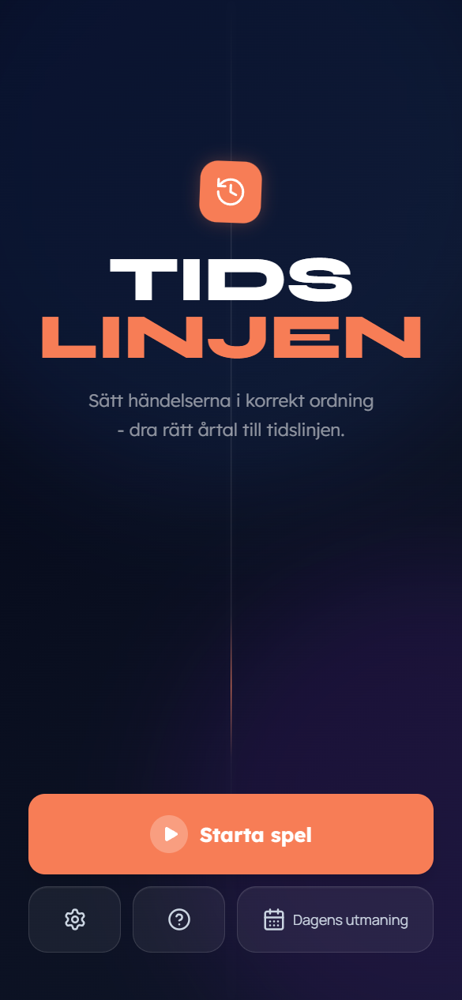
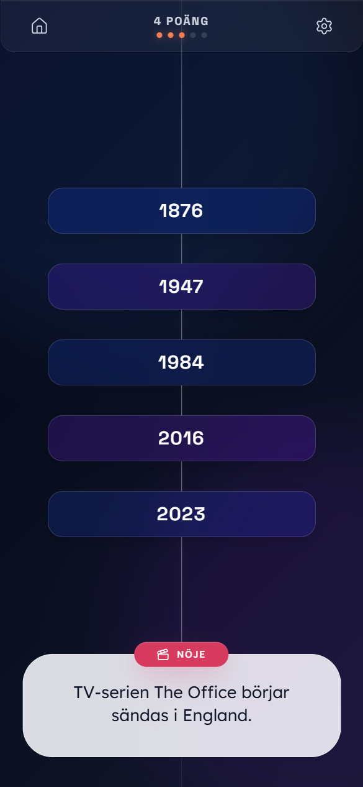
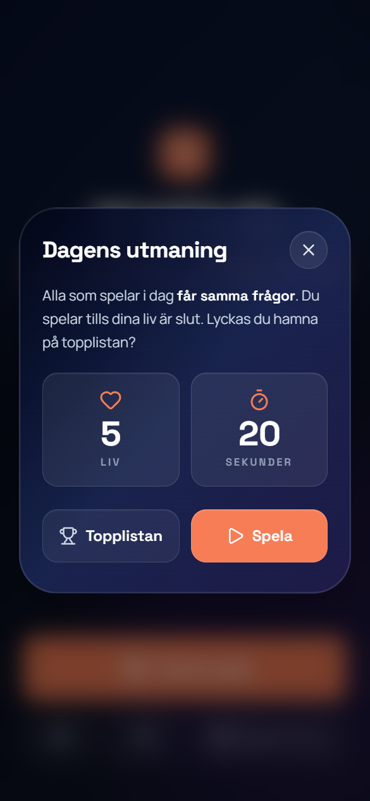
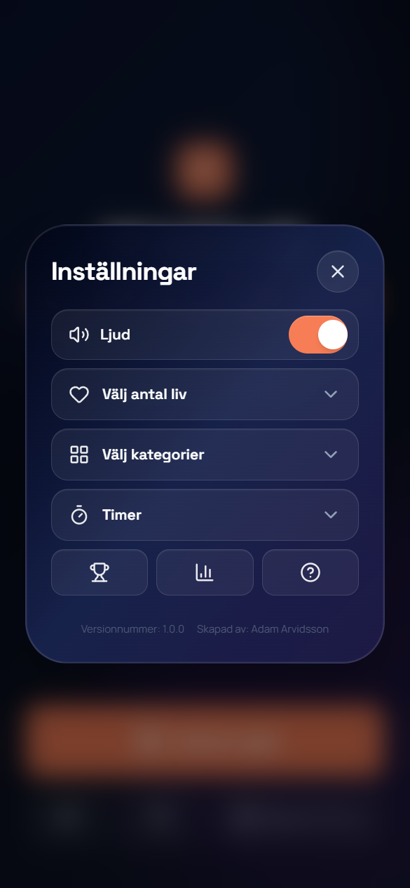

# Tidslinjen

Ett **tidslinjespel** på svenska: du får frågor om händelser utan synligt årtal och ska placera dem **i rätt kronologisk ordning** på en vertikal tidslinje genom att **dra** kortet till rätt läge mellan redan visade år. Rätt placering ger poäng; fel kostar **liv**. Spelet finns som **webbapp** (PWA) och kan byggas för t.ex. mobil med verktyg som Capacitor.

**Version** anges i `package.json` och visas i appen under **Inställningar** (längst ned).

## Skärmdumpar

<table>
  <tr>
    <td width="50%"></td>
    <td width="50%"></td>
  </tr>
  <tr>
    <td width="50%"></td>
    <td width="50%"></td>
  </tr>
</table>

---

## Så fungerar spelet

| Läge | Beskrivning |
|------|-------------|
| **Vanlig omgång** | Välj **antal liv** (eller ett försök), **kategorier** (en eller flera av sex ämnesfiler) och om **timer** per fråga ska användas. Starta och spela tills liv tar slut eller du klarat leken. |
| **Dagens utmaning** | Samma fråguppsättning för alla som spelar samma kalenderdag (svensk tid). **5 liv**, **20 sekunder** per fråga (fast inställning). Efter omgången kan du skicka in resultat till **topplista** om Supabase är konfigurerat. |

**Poäng & statistik** sparas lokalt i webbläsaren (highscore, spelstatistik, daglig streak). **Dagens utmaning** använder **Supabase** för topplista när miljövariabler är satta.

**År före Kristus** lagras som negativa tal i logiken, så t.ex. **1200 f.Kr.** kommer före **753 f.Kr.** på tidslinjen.

---

## Teknikstack

- **React 19** + **TypeScript**
- **Vite 6** (dev på port **3000**, `--host=0.0.0.0` för åtkomst i lokalt nätverk)
- **Tailwind CSS v4** (`@tailwindcss/vite`)
- **Motion** (animationer), **Lucide** (ikoner)
- **vite-plugin-pwa** — manifest, offline/cache för bl.a. CSV under `public/`
- **Supabase** (valfritt) — `daily_scores` + Edge Function `submit-daily-score`

Spellogik och CSV-laddning: `src/gameEngine.ts`, tillstånd: `src/chronosReducer.ts`, UI: `StartScreen`, `GameScreen`, `OverScreen`, `ChronosApp`, m.fl.

---

## Frågedata (CSV)

Aktuellt spel använder filerna under **`public/csv_2026/`** (format: `category`, `question`, `year`):

- `allmanbildning.csv`, `geografi.csv`, `historia.csv`, `noje.csv`, `personer.csv`, `sport.csv`

År kan anges som heltal eller som **`… f.Kr.`** (parsas till negativa år).

I koden finns även en lista över **äldre** CSV-sökvägar (`public/csv/`, annat kolumnnamn) i `src/gameEngine.ts` — används om du pekar om laddning dit.

---

## Kommandon

```bash
npm install          # dependencies
npm run dev          # utveckling (Vite)
npm run build        # produktionsbygge → dist/
npm run preview      # förhandsvisa build lokalt
npm run lint         # TypeScript (tsc --noEmit)
```

---

## Miljövariabler

Kopiera `.env.example` till **`.env.local`** (läs in av Vite) och fyll i det du behöver.

| Variabel | Syfte |
|----------|--------|
| `VITE_SUPABASE_URL` | Supabase-projekt-URL (topplista daglig utmaning) |
| `VITE_SUPABASE_ANON_KEY` | **Publishable/anon-nyckel** — aldrig `service_role` i `VITE_*` |
| `VITE_FORCE_DIRECT_DAILY_INSERT` | `true` = hoppa över Edge Function och skriv direkt till tabell (endast för felsökning) |
| `GEMINI_API_KEY` | Reserverad i config; spelet använder den inte i nuläget |
| `APP_URL` | Reserverad för ev. hosting/OAuth |

**Supabase:** tabell `daily_scores`, funktion **`submit-daily-score`** (deploy: `supabase functions deploy submit-daily-score`). Se kommentarer i `.env.example`.

---

## PWA

Bygget genererar bl.a. **web app manifest** och service worker (Workbox) enligt `vite.config.ts` — cache av bl.a. CSV och typsnitt. Lägg till på hemskärmen som vanlig PWA efter deploy till **HTTPS**.

---

## Kartläggning (huvudfiler)

```
src/
  main.tsx, App.tsx          # Rot, provider
  ChronosApp.tsx             # Modaler, inställningar, statistik, highscore
  ChronosGameContext.tsx     # Speltilstånd, start, daglig utmaning
  gameEngine.ts              # CSV, år, tidslinje, korrekt placering
  chronosReducer.ts          # Reducer & actions
  dailyChallengeApi.ts       # Topplista + inskick av poäng
  supabaseClient.ts          # Supabase-klient om env finns
public/
  csv_2026/*.csv             # Frågor (huvuddata)
```

---

## Licens och upphov

Appen är utvecklad som **Tidslinjen**; upphovsman visas i appen under Inställningar.

Om du saknar en äldre ren **vanilla**-version (`game.js` i samma repo) finns den inte bundlad här — denna kodbas är **React/Vite**-implementationen.
